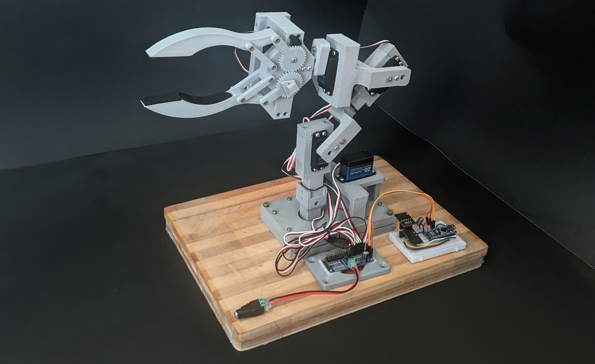
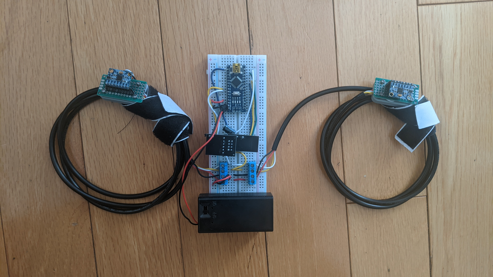
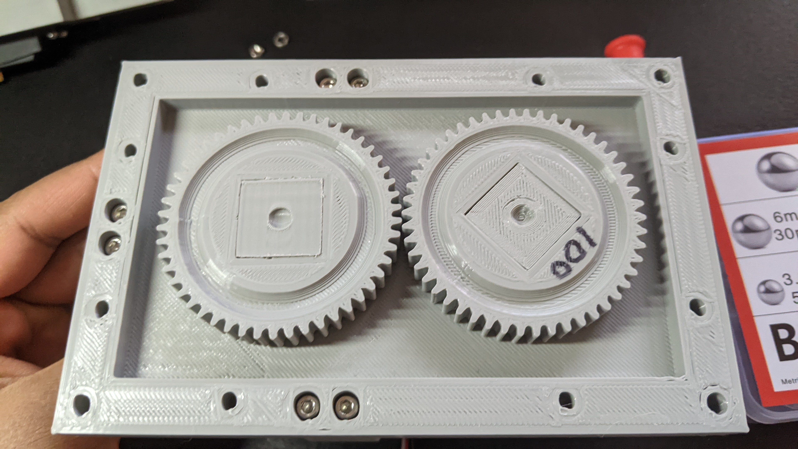
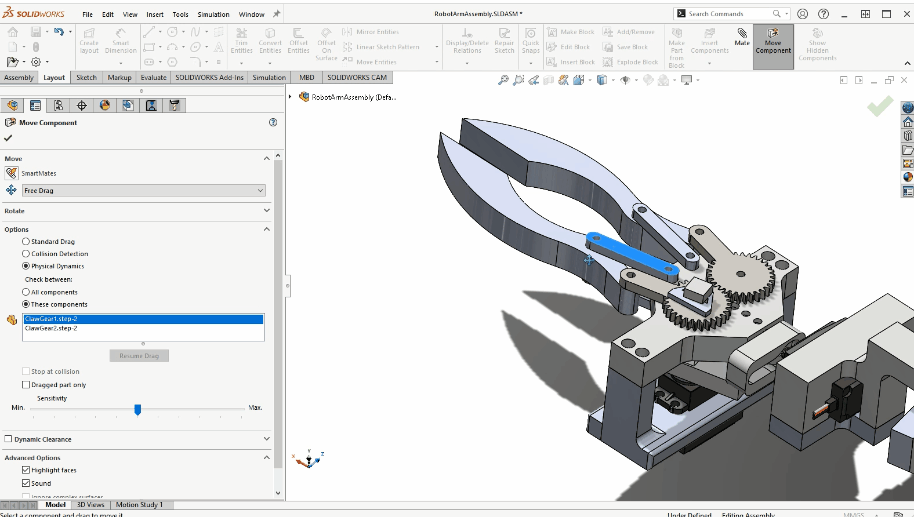
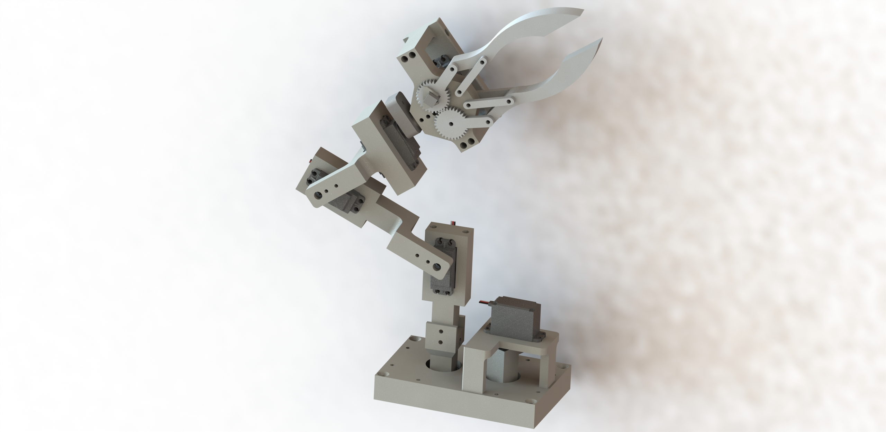
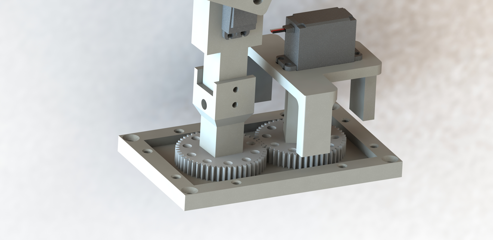

# Robotic-Arm
A robotic arm that mimics a user's arm gestures. It is purposed to help people with disabilities and meant for remote operations, and can also be used as a prototype in various other cases.

There are 2 parts to this project. The 1st part is the robotic arm itself, which has 5 DOF (5 servos) and uses an Arduino Nano, a Dedicated Servo Driver, and an NRF24L01 for recieving signals. The 2nd part is a gesture controller that straps onto the user's body. It has an Arduino Nano, an NRF24L01 module for transmitting data to the robotic arm, and 2 MPU6050's. The MPU6050s are velcroed onto the user's wrists, and then each direction of motion the user moves an arm in, causes a servo to move.

Programmed in Arduino IDE, models created in Solidworks, schematics created in KiCad.

Robotic Arm:

Gesture Controller:

- More updates to come!

## Schematics

## Demos
Some demos showing how certain mechanisms in the robotic arm work.

| Gear Movement Demo | Backside of Gears |
| :---: | :---: |
|   |  |

    <strong>Claw Demo</strong>

  

## Other Images
Rendered pictures of the 3D model I created using my own models designed for 3D printing combined with the servos from [GrabCAD](https://grabcad.com/library). Made in real-world scale and was designed using Solidworks:

Render of gear mechanism underneath the lid.

